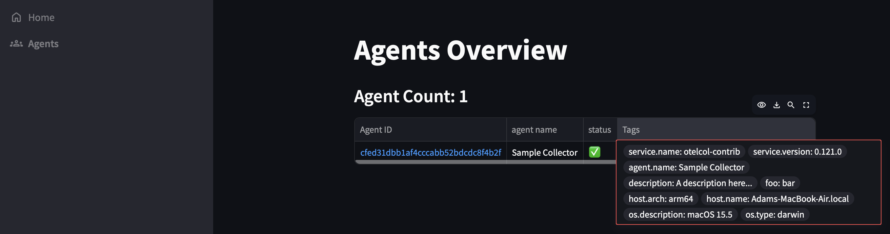
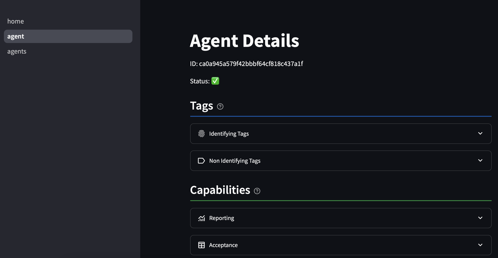

# OpAMP Server Python

> [!IMPORTANT]
> We're working on a brand new User Interface.
> This work also seperates the backend server from the UI making the project more modular.
> Check out the [new_ui](https://github.com/agardnerIT/opamp-server-py/tree/new_ui) branch.

This in an [OpenTelemetry OpAMP](https://opentelemetry.io/docs/specs/opamp/) server and UI written in Python.

The server listens on the standard port of 4320.
The server offers the following endpoints:

* `/v1/opamp` = Agents (eg. OpenTelemetry collectors) are configured to send data to this endpoint
* `/` = The root path (eg. `http://127.0.0.1:4320/` offers an overview of the server and connected agents)
  


* `/agents` = Offers a deeper overview of all connected agents



* `/agent/<agent-id>` = Offers a full overview of a single connected agent



It is important to note that OpAMP is an open protocol for agents to connect to, and be managed by, servers. Any software can thus act as an agent and be managed at scale using OpAMP.
Hopefully, OpAMP offers a new vendor-neutral way to perform software upgrades, maintenance and patching.

- Antivirus / security agents
- Observability agents
- Operating systems
- Any other software that runs and requires periodic updates or configuration changes

## Run it

```py
pip install -r requirements.txt
fastapi run server.py --host 127.0.0.1 --port 4320
```

## Sample Collector Config
An agent (eg. collector) needs to be configured to connect to the server. [A sample configuration file is provided](https://github.com/agardnerIT/opamp-server-py/blob/main/collector/config.yaml).

Download the contrib distribution binary (it has the [opamp extension](https://github.com/open-telemetry/opentelemetry-collector-contrib/tree/main/extension/opampextension) )into the root of this folder. 

```
./otelcol-contrib --config=collector/config.yaml
```

Go to `http://localhost:4320` and see the agent overview.

Go to `http://localhost:4320/agents` to see deeper info about each agent.