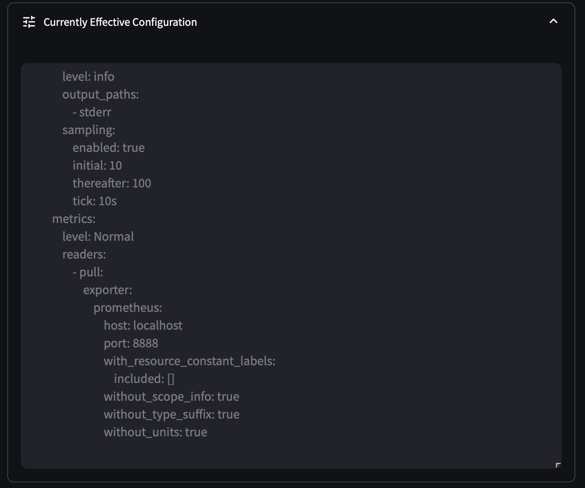

# OpAMP Server Python

This in an [OpenTelemetry OpAMP](https://opentelemetry.io/docs/specs/opamp/) server and UI written in Python.

The server and UI are seperate components. The server listens on the standard OpAMP port of `:4320`
The UI is written in Streamlit and is available on `:8501`

This app will show you:

- How many collectors you have running across your fleet
- Detailed stats for each collector such as:
  - Which pipelines are defined and which components make up each pipeline
  - Which components are _potentially_ available in each collector (ie. which receivers / processors / exporters and extensions etc. does your collector contain)
  - Which components are **actually** in use (running the contrib collector with lots of unused components and wondering which you can remove to slim down?)
- Prometheus compatible endpoint at `/metrics`

## Server

The server listens on the standard port of 4320.

The server offers the following endpoints:

* `/v1/opamp` = Agents (eg. OpenTelemetry collectors) are configured to send data to this endpoint
* `/metrics` = Prometheus endpoint for server metrics

Start the server with:

```py
pip install -r requirements.txt
fastapi run server.py --host 127.0.0.1 --port 4320
```
### More Screenshots




## User Interface

The UI is built using [Streamlit](https://streamlit.io).

There are currently 3 pages:

* `/` = The root path (eg. `http://127.0.0.1:8501/` offers an overview of the server and connected agents)
  


* `/agents` = Offers a deeper overview of all connected agents


* `/agent?id=<agent-id>` = Offers a full overview of a single connected agent


Start the server with:

```
streamlit run streamlit_app.py --server.address 127.0.0.1 --server.port 8501
```

## Sample Collector Config
An agent (eg. collector) needs to be configured to connect to the server. [A sample configuration file is provided](https://github.com/agardnerIT/opamp-server-py/blob/new_ui/collector/config.yaml).

Download the contrib distribution binary (it has the [opamp extension](https://github.com/open-telemetry/opentelemetry-collector-contrib/tree/main/extension/opampextension) )into the root of this folder. 

```
./otelcol-contrib --config=collector/config.yaml
```

Go to `http://localhost:8501` and see the agent overview.

Go to `http://localhost:8501/agents` to see deeper info about each agent.

## Background Information on OpAMP

It is important to note that OpAMP is an open protocol for agents to connect to, and be managed by, servers. Any software can thus act as an agent and be managed at scale using OpAMP.
Hopefully, OpAMP offers a new vendor-neutral way to perform software upgrades, maintenance and patching.

- Antivirus / security agents
- Observability agents
- Operating systems
- Any other software that runs and requires periodic updates or configuration changes
